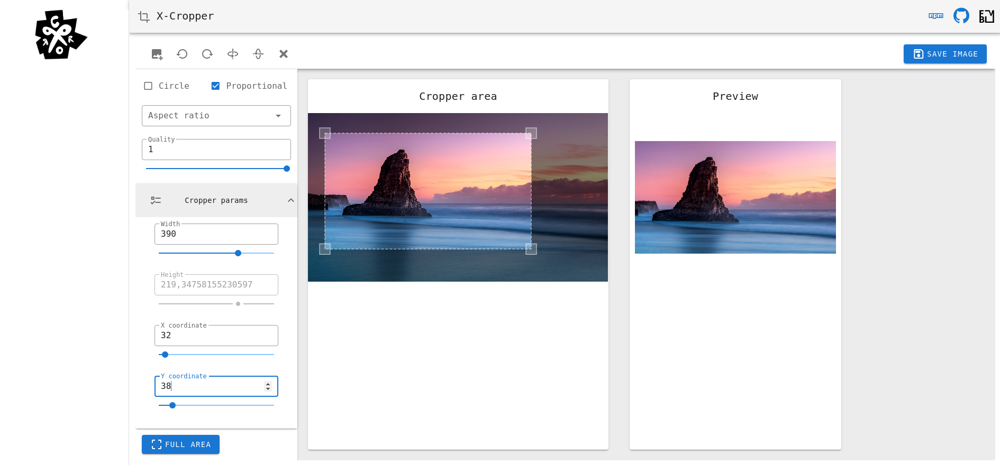

# XCropper

An image cropper and uploader component for VueJS with Vuetify

[X-Cropper Demo](https://mrsky1001.github.io/x-cropper/)

____

## Installation

### NPM

```bash
npm install x-cropper
```

### YARN

```bash
yarn add x-cropper
```

## Usage

Most basic example. This is going to insert the cropper with default options:

```vue
<template>
    <div>
        <h1>XCropper - crop all!</h1>
        <x-cropper></x-cropper>
    </div>
</template>
<script>
    import XCropper from "x-cropper";

    export default {
        components: {XCropper}
    }
</script>
```

Example with all the options and events:

```vue

<template>
  <div>
    <h1>XCropper - crop all!</h1>
    <x-cropper
        :options="{
            // system
            inputMimeTypes: ['image/jpeg', 'image/png', 'image/gif'],
            resultMimeType: 'image/jpeg',
            maxFileSize: 8000000, // 8MB
            layoutBreakpoint: 850,
            maxCropperHeight: 600,
            croppedAreaHeight: 400,
            croppedAreaWidth: 400,
            maxCroppedAreaWidth: 400,
            uploadData: {},
    
            isUploadTo: false,
            isPreviewOnDrag: true,
            isShowPreview: true,
            isShowToolbar: true,
            isShowFormParams: true,
            isCloseOnSave: true,
    
            cropArea: {
                minWidth: 8,
                minHeight: 8,
    
                // user changeable fields
                width: 0,
                height: 0,
                x: 20,
                y: 20,
            },
    
            // user changeable checks
            isProportional: true,
            isCircle: false,
    
            // user changeable fields
            aspectRatio: undefined,
            rotation: 0,
            maxCropAreaHeight: 0,
            frameLineDash: [5, 3],
            handleSize: 10,
            quality: 0.65,
    
            // colors
            frameStrokeColor: 'rgba(255, 255, 255, 0.8)',
            handleFillColor: 'rgba(255, 255, 255, 0.2)',
            handleHoverFillColor: 'rgba(255, 255, 255, 0.4)',
            handleHoverStrokeColor: 'rgba(255, 255, 255, 1)',
            handleStrokeColor: 'rgba(255, 255, 255, 0.8)',
            overlayFill: 'rgba(0, 0, 0, 0.5)',
    
            // classes
            cropperClasses: '',
            toolbarClasses: '',
            cropAreaClasses: '',
            formParamsClasses: '',
    
            // labels
            dropareaLabel: 'Select or drop image...',
            selectBtnLabel: 'Select image',
            rotateLeftLabel: 'Rotate left',
            rotateRightLabel: 'Rotate right',
            flipHorizontalLabel: 'Flip horizontal',
            flipVerticalLabel: 'Flip vertical',
            clearLabel: 'Clear',
            saveLabel: 'Save image',
            circleLabel: 'Circle',
            proportionalLabel: 'Proportional',
            aspectRatioLabel: 'Aspect ratio',
            previewLabel: 'Preview',
            cropAreaLabel: 'Cropper area',
            cropParamsLabel: 'Cropper params',
            cropAreaWidthLabel: 'Width',
            cropAreaHeightLabel: 'Height',
            cropAreaXCoordLabel: 'X coordinate',
            cropAreaYCoordLabel: 'Y coordinate',
            fillCropAreaLabel: 'Full area',
            qualityLabel: 'Quality'
    }"
    @cropper-error="someAction(errorMessage)"
    @cropper-file-selected="someAction(file)"
    @cropper-preview="someAction(imageSource)"
    @cropper-saved="someAction(cropData)"
    @cropper-cancelled="someAction()"
    @cropper-uploaded="someAction(serverResponse)"
    ></x-cropper>
  </div>
</template>
<script>
import XCropper from 'x-cropper'

export default {
  name: 'XCropper',
  components: {XCropper}
}
</script> 
```

### UI


